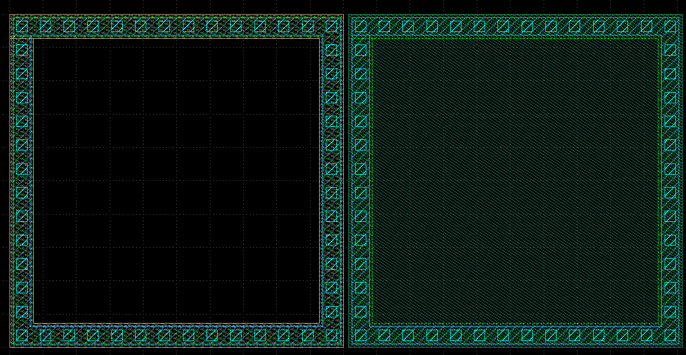
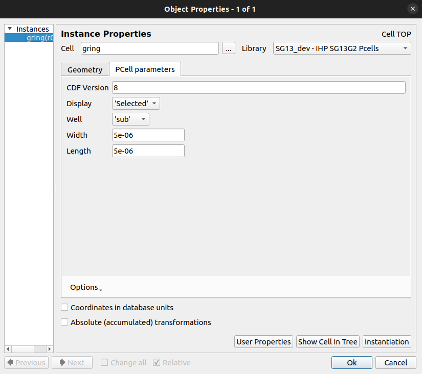
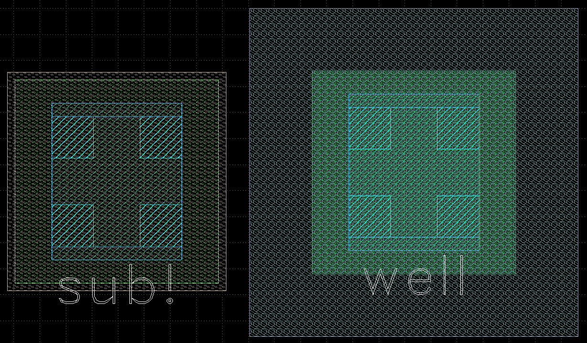
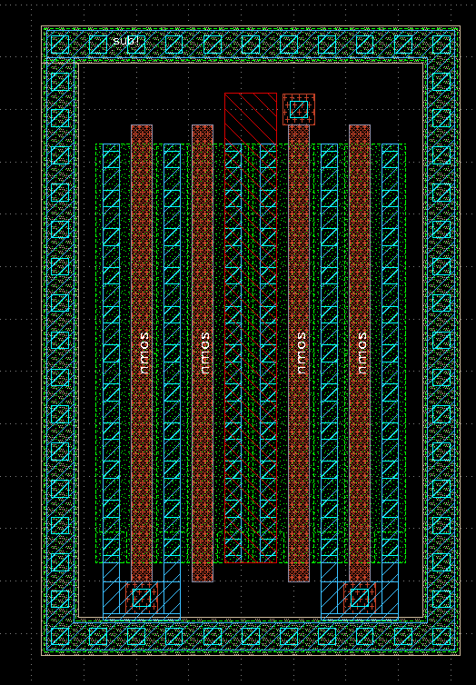
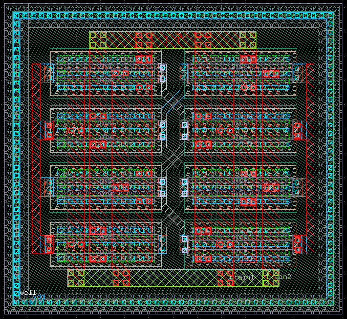

# Guardring / Tapring PCell for KLayout (IHP Open PDK)

This repository provides a **DRC-clean, LVS-compatible PCell** for generating **Guardring / Tapring structures** in [KLayout](https://www.klayout.de/), tailored for the **IHP Open PDK (SG13G2 process)**.

These cells closely follow the style of native PCells in the IHP PDK and are designed to streamline layout generation for analog and mixed-signal designs.

---

## ✨ Features

- ✅ DRC-clean guardring & tapring generation  
- ✅ LVS recognizability with proper text/geometry markers  
- 🔧 Parameterizable via KLayout GUI  
- 🔄 Compatible with existing IHP PDK flow  
- 💡 Educational example for extending PDKs with custom PCells

---

## 📦 Installation Guide

1. **Clone this repository:**

2. **Copy the `gring_code` folder into the IHP PDK PCell directory:**

    ```
    IHP-Open-PDK/ihp-sg13g2/libs.tech/klayout/python/sg13g2_pycell_lib/ihp/
    ```

3. **Register the module in `__init__.py`:**

    Open the following file:

    ```
    IHP-Open-PDK/ihp-sg13g2/libs.tech/klayout/python/sg13g2_pycell_lib/__init__.py
    ```

    Add `'gring_code',` to the `moduleNames` list:

    ```python
    moduleNames = [
        'bondpad_code',
        'rfcmim_code',
        'gring_code',  # 👈 Add this line
        'esd_code',
        'rfmosfet_base_code',
    ]
    ```

4. **Set default parameters in `sg13g2_tech.json`:**

    In the same directory, locate and open `sg13g2_tech.json`, then add:

    ```json
    "gring_defL": 5e-6,
    "gring_defW": 5e-6,
    ```

    This sets the default width and length to 5 µm.

---

## 🧪 Usage in KLayout

Once installed, you will see the new PCell in the KLayout device list.

### Tapring Variants

In the image below:
- **Left:** NTAP  
- **Right:** PTAP  
<p align="center">  </p>


You can choose between the two by opening the PCell settings dialog:
<p align="center">  </p>


These PCells are based on the Open PDK tap devices

---

## ⚠️ LVS Compatibility Notes

The default PCells in the PDK are **not LVS recognizable** without modifications. Follow these guidelines:

### NTAP
- Add a **`sub!`** text label on the `TEXT.drawing` layer.
- Surround the structure with `Substrate.drawing`.

### PTAP
- Add a **`well`** text label on the `TEXT.drawing` layer.
- Surround the active region with `nBuLay.drawing`.
- Surrounding nBulay should be of certain widht $(\approx 1.5\ \mu\text{m})$ should be sufficient.
- Consult DRC for the surrounding nBulay

Here’s what the built-in tap devices look like:
<p align="center">  </p>


### Example: LVS-Ready NTAP Implementation
<p align="center">  </p>

### Example: LVS-Ready PTAP Implementation
<p align="center">  </p>

Use the DRC to verify compliance and adjust dimensions as needed.

---

## 📚 Learn More

To learn more about open-source analog/mixed-signal IC design, visit the official IHP Open PDK Analog course:
👉 https://github.com/IHP-GmbH/IHP-AnalogAcademy
To learn more about the Open Source PDK visit the official github repository:
👉 https://github.com/IHP-GmbH/IHP-Open-PDK

---

## 🛠️ Contributions & Feedback

Feel free to submit issues or pull requests to improve this project.

---
